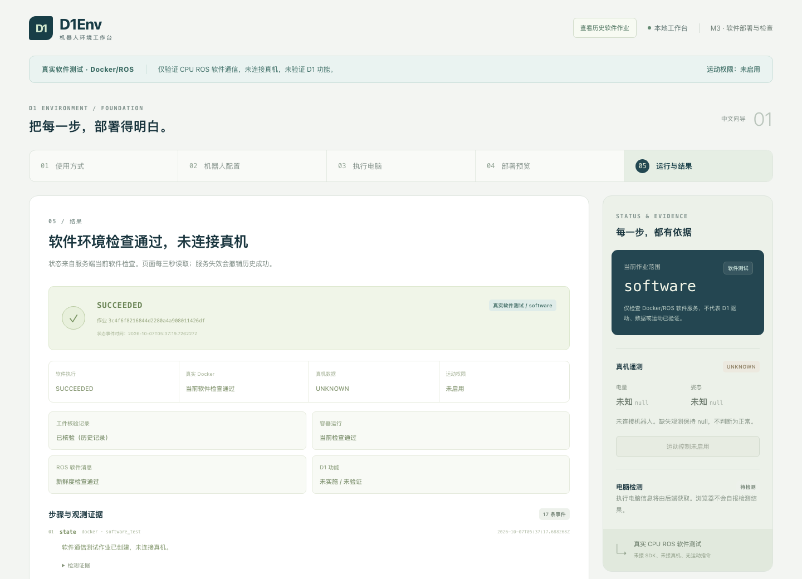
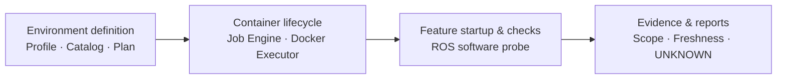

# D1Env

**A profile-driven environment and deployment toolkit for D1 robotics development.**

D1Env 将环境配置、容器生命周期与功能启动分层组织。中文 Web 向导与本地 API 提供运行环境准备；CLI 与向导共用诊断、计划、部署和报告服务。项目参考 [IOEnv CLI](https://github.com/ioai-tech/ioenv_cli) 的环境管理思路，独立实现部署引擎、持久化任务与分层就绪检查。

**Current release: 0.3.0 · macOS Apple Silicon software preview.** 已验证已有 Docker 环境中的 ROS 软件部署与通信检查；全新电脑首次 Docker 安装、Linux 发行、D1 SDK 与硬件接入仍待验收。

[Quick Start](#quick-start) · [Commands](#commands) · [Architecture](#architecture) · [Releases](https://github.com/GARERYIES/D1Env/releases) · [Documentation](#documentation)



## Features

- **Profile-driven environments** — 严格校验的软件配置与能力目录，生成确定性部署计划；未支持型号在执行前阻断。
- **Runtime preparation** — 检查并复用本机 Docker，按固定官方来源下载、校验并引导安装，自动准备发行包内的 ROS 镜像。
- **Container lifecycle** — 部署、检查、停止和重试本项目拥有的软件容器，保留用户数据、镜像与其他项目。
- **Durable jobs** — 持久化任务、事件与证据，支持重复请求去重、取消、中断恢复和当前状态复核。
- **Scoped readiness** — 分别展示运行环境、容器、ROS 通信和机器人能力；缺失或过期数据保持 `UNKNOWN` / `null`。
- **Local UI and reports** — 中文五步向导、明确的失败环节与恢复提示，以及去敏 JSON / Markdown 报告。

## Quick Start

### Prerequisites

当前完整候选包适用于 **Mac Apple Silicon**，需要已安装 Google Chrome。包内包含 Python 运行时、依赖、编译后的界面和固定 ROS 镜像；终端用户无需安装 Node/Python、编译 ROS 或编辑 YAML。

Docker 已安装时会核验并复用。缺少 Docker 时，程序提供官方安装包下载、校验和原生安装引导；Docker 许可与 macOS 系统权限由用户在官方/系统窗口确认。首次实际安装尚未在全新 Mac 验收。

### Install

从 [0.3.0 software preview](https://github.com/GARERYIES/D1Env/releases/tag/v0.3.0-software-candidate) 下载：

| File | Contents |
|---|---|
| `D1Env-0.3.0-macos-aarch64.tar.gz` | 完整运行时、界面及配套 ROS 镜像，约 168 MB |
| `SHA256SUMS.txt` | 发行归档 SHA-256 |
| `START-HERE.md` | 安装入口、操作步骤与当前验证范围 |

解压后双击 **`D1Env.command`**。程序新开独立 Chrome 窗口，默认进入 MOCK 演示；也可在解压目录运行 `./d1env.sh`。

### Basic Usage

1. 选择 **MOCK 演示**，体验五步向导、故障恢复与报告导出。
2. 选择 **真实软件测试**，使用 CPU ROS 通信测试配置。
3. 在“执行电脑”页点击 **准备运行环境**，查看检测、工件校验与准备任务。
4. 环境准备完成后，进入 **部署预览**，确认本次计划并启动软件测试。
5. 查看当前 ROS 通信结果；需要时停止本作业服务、按原计划重试或导出诊断报告。

`runtime_environment` 成功表示运行环境准备完成；`software` 成功表示本次 ROS 软件检查通过。所有 D1 真实型号仍禁用，机器人状态保持 `UNKNOWN`，运动未启用。

## Commands

CLI 与 Web 向导使用同一服务和任务引擎。完整包可用 `./d1env.sh <command>`；源码环境使用 `d1env <command>`。

| Command | Description |
|---|---|
| `d1env ui` | 启动本地中文向导，默认 MOCK |
| `d1env doctor` | 只读检测本机软件条件 |
| `d1env plan --profile demo --mode mock` | 预览 MOCK 部署计划 |
| `d1env plan --profile ros-probe --mode software_test` | 预览固定 ROS 软件测试计划 |
| `d1env deploy PLAN_ID --request-key KEY` | 执行已保存且再次复核通过的计划 |
| `d1env status JOB_ID` | 查看持久化任务状态 |
| `d1env stop JOB_ID` | 停止本作业拥有的软件测试服务 |
| `d1env import-image BUNDLE` | 导入符合来源锁的 ROS 工件，供旧包或研发使用 |
| `d1env report JOB_ID --output report.md` | 导出去敏 Markdown / JSON 报告，不覆盖已有文件 |

## Configuration

环境由 `profiles/` 下的严格数据 Profile 定义，描述配置版本、平台条件、能力状态、网络要求与不可变工件身份。Profile 是数据，不接受可执行 YAML、任意 shell 或 Compose 模板；界面/API 不接受用户自由指定的镜像来源。

| Profile | Purpose | Current state |
|---|---|---|
| [`demo`](profiles/demo.yaml) | MOCK 软件演示 | 已实现，不访问 Docker 或机器人 |
| [`ros-probe`](profiles/ros-probe.yaml) | CPU ROS 发布/订阅软件检查 | Mac Apple Silicon + Docker 实际验证 |
| [`edu-zsl-1`](profiles/edu-zsl-1.yaml) / [`edu-zsl-1w`](profiles/edu-zsl-1w.yaml) | D1 点足 / 轮足候选 | `not_implemented`，真实执行禁用 |
| [`maxpro`](profiles/maxpro.yaml) / [`unknown`](profiles/unknown.yaml) | 待适配 / 身份未确认 | 真实执行禁用 |

型号、SDK、固件和架构分别匹配；能力声明与实现/集成/硬件验证独立记录。界面配置选择不替代兼容性证据。

## Architecture



| Layer | Responsibility | Modules |
|---|---|---|
| Environment definition | 解析可信配置、检查条件、生成计划与准备工件 | `catalog.py`、`planner.py`、`setup/`、`artifacts.py` |
| Container lifecycle | 持久化任务、执行受限 Docker 操作、归属复核与恢复 | `jobs/`、`docker/` |
| Feature startup & checks | 启动指定软件、验证通信与数据新鲜度、生成范围明确的结果 | `containers/ros-probe/`、`service.py`、`reports.py` |

UI、CLI 与 API 共用应用服务。后续 D1 SDK、传感器与导航按独立适配器接入第三层。上游机制与本项目改造对应见 [IOENV Blueprint](docs/IOENV_BLUEPRINT.md)。

## Compatibility & Validation

| Scope | Evidence / status |
|---|---|
| MOCK、主机只读检查、任务与报告 | 已验证 |
| Mac Apple Silicon 上已有 Docker / 固定 ROS 镜像复用 | 实际 UI / API 已验证 |
| 真实容器部署、ROS 通信、停止、故障与重试 | 实际软件测试已验证 |
| Docker 官方包来源、摘要、签名与 Gatekeeper | 下载及只读核验已验证；不等于首次安装通过 |
| 全新 Mac 的安装、许可/系统授权、空 daemon 首次导入 | `NOT_RUN` |
| Ubuntu 22.04 x86_64 正式安装包与新机验收 | 后续目标；当前自动准备入口禁用 |
| D1 SDK、传感器、建图/导航、运动 | `not_implemented`；无硬件通过声明 |
| D1Env 发行签名/公证、下载隔离验收、完整动态库许可清单 | 未完成 / `blocked` |

0.3.0 阶段记录：Python 3.10 / 3.12 各 **467 PASS / 0 FAIL / 0 SKIP**，UI **55 / 0 / 0**，完整包内真实浏览器 **2 / 0 / 0**。这是记录环境中的软件证据；详细命令、退出码、失败历史与未验证范围见 [交付报告](reports/M3-setup-summary.md) 和 [独立审查](reports/M3-setup-review.md)。

实际界面：[运行环境准备](reports/screenshots/m3-setup/m3-ui-runtime-prepare-success.png) · [软件故障](reports/screenshots/m3-setup/m3-ui-software-failure.png) · [MOCK 成功](reports/screenshots/m3-setup/m3-ui-mock-success.png) · [MOCK 故障](reports/screenshots/m3-setup/m3-ui-mock-failure.png)。MOCK 截图保留演示标识。

## Development

源码开发需要 uv、Node 24.x/npm 和 Chrome。GitHub 源码归档不包含构建后的前端、Python 运行时或 ROS 镜像；直接使用者请选择完整 Release 包。

```sh
git clone https://github.com/GARERYIES/D1Env.git
cd D1Env
npm --prefix frontend ci
npm --prefix frontend run build
UV_PYTHON_INSTALL_DIR="$PWD/work/python" UV_PROJECT_ENVIRONMENT="$PWD/work/venv310" uv sync --locked --python 3.10
./scripts/start-demo.sh
```

基础软件检查：

```sh
work/venv310/bin/python -m pytest -q
work/venv310/bin/ruff check src/d1env tests scripts/build-release.py
work/venv310/bin/mypy src/d1env scripts/build-release.py
npm --prefix frontend test -- --run
npm --prefix frontend run build
```

发行/浏览器测试需要相应工件与私有测试会话。缺环境的 `SKIP` 或 `NOT_RUN` 不计为通过。打包输入与来源锁见 [Packaging](packaging/README.md)。

## Notes

本地服务默认仅监听 `127.0.0.1`，使用会话认证及 Host / Origin / CSRF 校验。Docker daemon 操作权属于高权限信任边界；执行器通过白名单与资源归属约束操作，不接受浏览器提交自由命令。

默认非 privileged，不挂载整个 `/dev`，不修改网卡、驱动、固件或厂家启动脚本。停止和恢复仅处理本项目拥有的资源；软件停止不代表硬件急停。

## Roadmap

- **M0–M2** — 来源审计、严格契约、计划/任务引擎与中文 MOCK 向导：已交付。
- **M3** — Docker/ROS 软件链与 Mac 候选：已交付；Linux 正式发行和干净系统安装继续验收。
- **M4** — 一个准确型号 / SDK / 固件组合的只读遥测适配。
- **M5** — 传感器、时间/坐标契约、建图和导航软件链。
- **M6** — 独立运动安全设计与现场硬件验收。

每阶段按证据独立收口。详见 [Roadmap](docs/ROADMAP.md) 与 [Acceptance Matrix](docs/ACCEPTANCE.md)。

## Documentation

[Start Here](START_HERE.md) · [Design](docs/superpowers/specs/2026-10-06-d1env-design.md) · [Source Audit](docs/research/SOURCE_AUDIT.md) · [Source Index](docs/research/SOURCES.md) · [Robot Integration Checklist](docs/ROBOT_INTEGRATION_CHECKLIST.md)

历史记录：[M2](reports/M2-summary.md) · [M3 0.2.0](reports/M3-summary.md) · [原 README](README-HISTORY.md) · [原始交接入口](START_HERE-HISTORY.md) · [GitHub 发布记录](reports/GITHUB_UPDATE_0.3.0.md)。历史报告中的“未推送”描述验收当时的状态。

## Acknowledgements & License

参考 [IOEnv CLI](https://github.com/ioai-tech/ioenv_cli) 的环境组织与生命周期机制；固定源码、改造理由及许可记录见 [IOENV Blueprint](docs/IOENV_BLUEPRINT.md)。本项目独立实现，不附带厂商 SDK 或 Docker 专有安装器。

D1Env 整体项目许可证尚未选定。第三方组件保留各自的来源与许可，见 [Third-party Notices](THIRD_PARTY_NOTICES.md) 及 `docs/build/`；上游许可证不自动成为本项目许可证。
